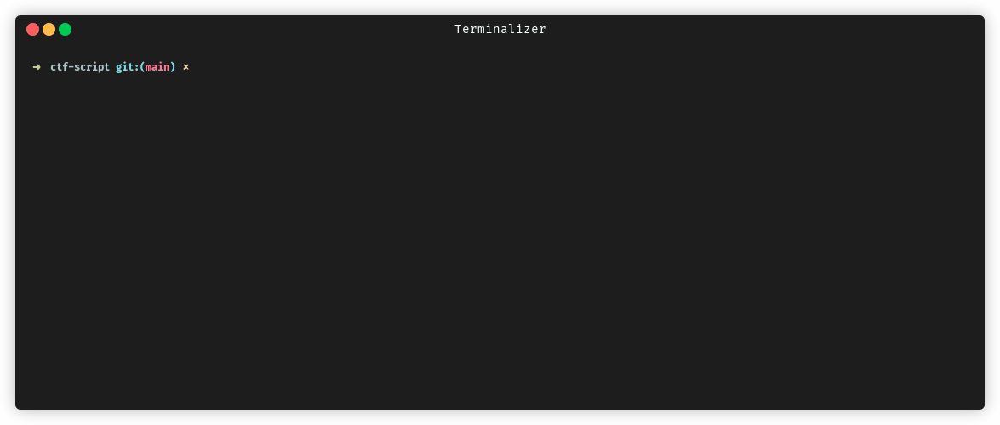

# CTF Script

Opinionated command line interface (CLI) tool to manage Capture The Flag (CTF) challenges.
It uses:
- YAML files to describe a challenge and forum posts
- OpenTofu (terraform fork) to describe the infrastructure
- Incus (LXD fork) to run the challenges in containers
- Ansible playbooks to configure the challenges



This tool is used by the NorthSec CTF team to manage their challenges since 2025.
[NorthSec](https://nsec.io/) is one of the largest on-site cybersecurity CTF in the world, held annually in Montreal, Canada, 
where 700+ participants compete in a 48-hour long CTF competition.

## Features and Usage

- `ctf init` to initialize a new ctf repository
- `ctf new` to create a new challenge. Supports templates for common challenge types.
- `ctf deploy` deploys the challenges to a local (or remote) Incus server
- `ctf validate` runs lots of static checks (including JSON Schemas) on the challenges to ensure quality
- `ctf stats` provide lots of helpful statistics about the CTF
- and many more. See `ctf --help` for the full list of commands.

To run `ctf` from any directory, set up the `CTF_ROOT_DIR` environment variable to make the script
execute in the right directory or execute the script from that directory. If not set, `ctf` will go up the directory
tree until it finds `challenges/` and `.deploy` directories, which is the root of the CTF repository.

## Structure of a CTF repository

```
my-ctf/
├── challenges/                   # Directory containing all the tracks
│   ├── track1/                   # Directory for a specific track that contains N flags. 
│   │   ├── track.yaml            # Main file that describes the track
│   │   ├── files/                # Directory that contains all the files available for download in the track
│   │   │   ├── somefile.zip
│   │   │   ├── askgod/
│   │   │   │   ├── gifs/         # GIF directory for askgod fireworks.
│   │   │   │   │   └── my-gif.gif
│   │   │   │   ├── sounds/       # Sound directory for askgod fireworks.
│   │   │   │   │   └── my-sound.mp3
│   │   ├── ansible/              # Directory containing Ansible playbooks to configure the track
│   │   │   ├── build.yaml        # Optional: Playbook when a build container is needed
│   │   │   ├── deploy.yaml       # Main playbook to deploy the track
│   │   │   └── inventory         # Inventory file for Ansible
│   │   ├── terraform/            # Directory containing OpenTofu (terraform fork) files to describe the infrastructure
│   │   │   └── main.tf           # Main OpenTofu file to deploy the track
│   │   ├── posts/                # Directory containing forum posts related to the track
│   │   │   ├── track1.yaml       # Initial post for the track
│   │   │   └── track1_flag1.yaml # Inventory file for Ansible

```

## Installation

Install with [uv](https://docs.astral.sh/uv/guides/tools/):

```bash
uv tool install git+https://github.com/nsec/ctf-script.git
```

Install with pipx:

```bash
pipx install git+https://github.com/nsec/ctf-script.git
```

Install with pip:

```bash
pip install git+https://github.com/nsec/ctf-script.git
```

### Add Bash/Zsh autocompletion to .bashrc

```bash
echo 'eval "$(register-python-argcomplete ctf)"' >> ~/.bashrc && source ~/.bashrc # If using bash
echo 'eval "$(register-python-argcomplete ctf)"' >> ~/.zshrc && source ~/.zshrc   # If using zsh
```

## Development

Install with [uv](https://docs.astral.sh/uv/guides/tools/) virtual environment:

```bash
git clone https://github.com/nsec/ctf-script.git
cd ctf-script
uv venv venv
source venv/bin/activate
uv pip install -e .
```

Install with virtual environment and pip:

```bash
git clone https://github.com/nsec/ctf-script.git
cd ctf-script
python3 -m venv venv
source venv/bin/activate
pip install -e .
```
